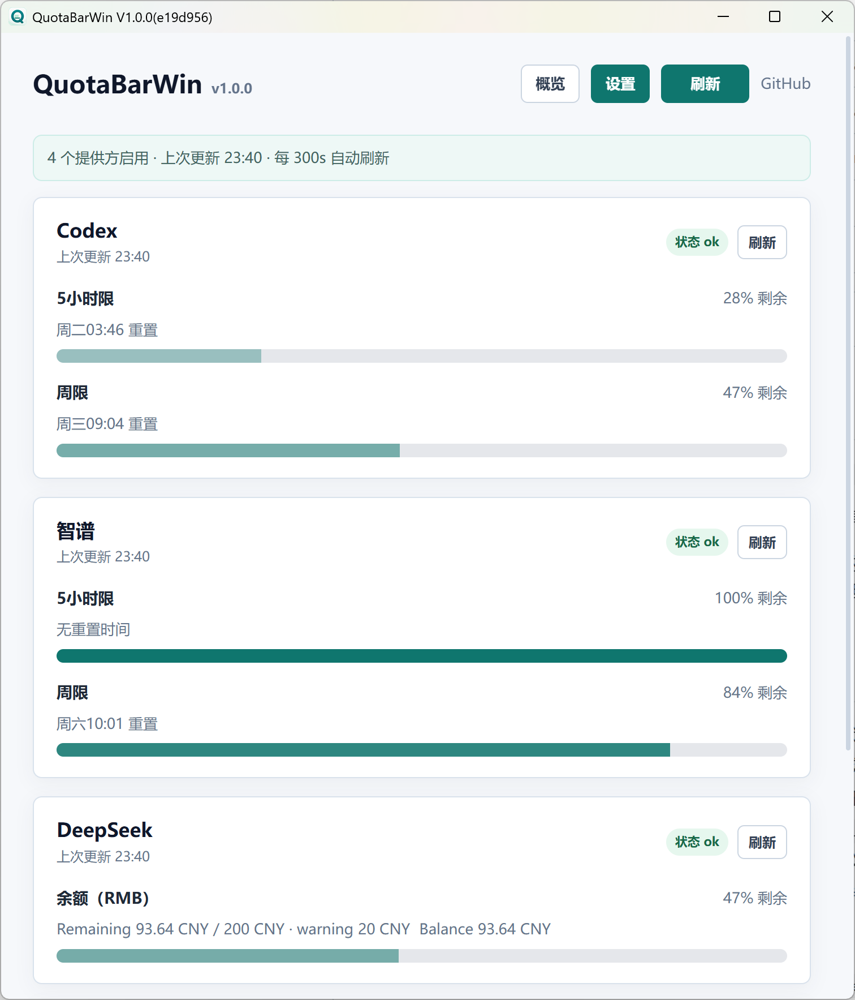
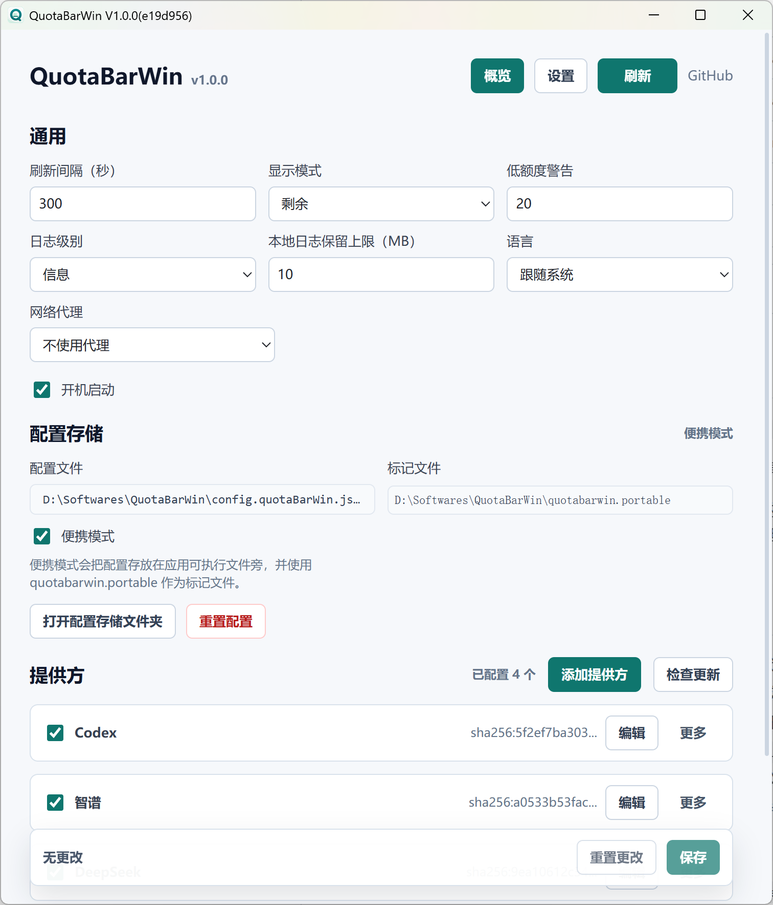
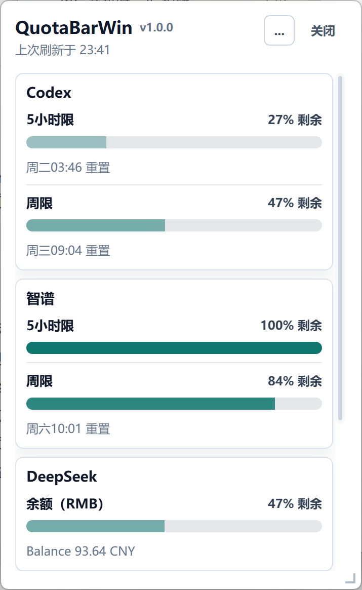

<p align="center">
  
</p>

<h1 align="center">QuotaBarWin</h1>

QuotaBarWin is a Windows-only desktop app for monitoring AI usage and quota windows across multiple services, with both a main window and a quick tray popup.

If you are on macOS, consider [CodexBar](https://github.com/steipete/CodexBar), a macOS menu bar app for monitoring AI usage.

Default documentation is Simplified Chinese: [README.md](README.md).

---

## Documentation

- [Simplified Chinese README](README.md)
- [Remote Provider Guide](docs/remote-provider-guide.en.md)
- [Agent / CLI Guide](docs/cli.en.md)
- [Remote Provider Examples](examples/remote-providers/)
- [Remote Provider registry example](examples/remote-providers/registry.json)
- [Contribution Guide](CONTRIBUTING.md)
- [Security Policy](SECURITY.md)
- [Code of Conduct](CODE_OF_CONDUCT.md)
- [Open Source Readiness Audit](docs/open-source-checklist.md)

---

## Release Shape

- Platform: **Windows**
- Distribution: **portable zip + single exe**
- Current version: **v1.0.1**
- Stack: Tauri 2, Rust 2021, React 19, TypeScript, Vite
- Current config schema version: **14**

---

## Screenshots

The main window includes an overview page and a settings page. The tray popup is optimized for quick quota checks.

<p align="center">
  
  
</p>

<p align="center">
  
</p>

---

## Quick Start

The QuotaBarWin release package does not include your account credentials and does not enable any service account by default. The app is configured with the QuotaBarWin-maintained remote Provider source, and Settings loads installable Providers from this registry:

[QuotaBarWin-maintained Provider registry](https://raw.githubusercontent.com/Shawlaw/QuotaBarWin/main/examples/remote-providers/registry.json)

**Security notice: only install and use Providers you trust. Provider scripts can directly read the AI credentials you configure for them and make network requests.**

### 1. Install And Run

1. Download the Windows portable zip from GitHub Releases and extract it to any folder.
2. Run `QuotaBarWin.exe`. For the portable zip, config, logs, secrets, and Provider cache are stored beside the exe by default.
3. The current example Providers use `node` as their runtime. Before installing or refreshing them, make sure this works on the machine:

```powershell
node --version
```

### 2. Choose A Project-Maintained Provider

The QuotaBarWin-maintained registry currently contains these manifests; the actual installable list is loaded from the registry:

| Manifest ID | Display name | What it monitors | Common credential / config |
|---|---|---|---|
| `kimi-coding` | Kimi Coding Usage | Kimi coding quota usage | `KIMI_API_KEY` |
| `bigmodel-coding-plan` | BigModel Coding Plan | Zhipu / BigModel coding plan quota | `BIGMODEL_API_KEY` |
| `codex-usage` | Codex Usage | ChatGPT / Codex 5h and weekly usage | Reads local Codex auth by default; can be overridden with `CODEX_ACCESS_TOKEN`; proxy notes are in section 5. |
| `deepseek-balance` | DeepSeek Balance | DeepSeek pay-as-you-go balance | `DEEPSEEK_API_KEY`, with optional reference total, low-balance threshold, and currency. |
| `time-flies` | 光阴似箭 (Time Flies) | Minutes remaining today, this week, this month, and this year | None; uses only the local timezone and current time. |

### 3. Install A Provider

**Before installing, confirm that the source is trusted. Provider scripts run on your machine, can read the tokens, API keys, cookies, account IDs, and other credentials configured for them, and can access the network.**

1. Open **Settings → Providers → Add Provider**.
2. The QuotaBarWin-maintained Provider source should load automatically. If the list is empty, open **Manage Source** and paste the registry URL above.
3. Click **Install** on the Provider you want. Installed Providers are enabled by default, and can be disabled with the checkbox in the Provider list.
4. For multiple accounts on the same Provider, click **Add account** on the already-installed item.

### 4. Configure Credentials

Return to **Settings → Providers**, expand the installed Provider, and fill **Environment variables**. Prefer `${secret:...}`, `${env:...}`, or `${file:...}` placeholders instead of pasting plain tokens into config.

| Provider | Environment variables example | Secret file |
|---|---|---|
| Kimi | `KIMI_API_KEY=${secret:KIMI_API_KEY}` | `<config-dir>\secrets\KIMI_API_KEY.txt` |
| BigModel | `BIGMODEL_API_KEY=${secret:BIGMODEL_API_KEY}` | `<config-dir>\secrets\BIGMODEL_API_KEY.txt` |
| DeepSeek | `DEEPSEEK_API_KEY=${secret:DEEPSEEK_API_KEY}` | `<config-dir>\secrets\DEEPSEEK_API_KEY.txt` |
| Codex usage | Reads local Codex auth by default | Optional `CODEX_ACCESS_TOKEN`, `CODEX_ACCOUNT_ID`, `CODEX_AUTH_FILE`, or proxy env vars |

You can find `<config-dir>` in **Settings → General → Configuration storage**, or click **Open config storage folder**. Create the `secrets` folder manually if it does not exist yet; each secret file only needs to contain the matching token or API key.

### 5. Codex Proxy

When Codex usage needs a proxy, you can set it in that Provider's **Environment variables**, for example:

```text
HTTPS_PROXY=http://127.0.0.1:7890
```

The Codex usage script checks proxies in this order: `QBWIN_PROXY_URL`, `HTTPS_PROXY`, `HTTP_PROXY`, then `ALL_PROXY`. Supported protocols are `socks5:`, `socks5h:`, `http:`, and `https:`. If a proxy URL was configured for that Provider during installation, QuotaBarWin injects it as `QBWIN_PROXY_URL`, which has the highest priority. For complete request, auth, and proxy notes, see [`examples/remote-providers/codex-usage/api.en.md`](examples/remote-providers/codex-usage/api.en.md).

### 6. Multiple Accounts

For multiple accounts, keep the left side as the env var expected by the script and change the secret name on the right. For example, two Kimi account instances can use:

```text
# Kimi Personal account instance
KIMI_API_KEY=${secret:KIMI_PERSONAL_API_KEY}
```

```text
# Kimi Work account instance
KIMI_API_KEY=${secret:KIMI_WORK_API_KEY}
```

Create the matching files:

```text
<config-dir>\secrets\KIMI_PERSONAL_API_KEY.txt
<config-dir>\secrets\KIMI_WORK_API_KEY.txt
```

### 7. Save And View

Click **Save**, return to **Overview**, or open the tray popup to view quota status. You can refresh all Providers globally or refresh one Provider from its card.

---

## Agent / CLI

The portable release also includes `QuotaBarWin.Cli.exe`. It reuses installed Providers, credentials, and configuration to give agents and scripts JSON-only quota queries and threshold decisions. It does not open a window or tray, or start another desktop-app instance.

For example, have an agent refresh Codex's five-hour window before a quota-intensive step:

```powershell
.\QuotaBarWin.Cli.exe check --provider codex-usage --window 5h --min-remaining-percent 20
```

Exit code `0` means work can continue, `10` means the quota is below the threshold and work should be deferred or switched, `11` means the data cannot be safely assessed (for example, a stale Provider), and `20` means refresh or configuration failed. The default is a live refresh; explicitly pass `--cached` to read only the latest disk snapshot.

See the [Agent / CLI Guide](docs/cli.en.md) for commands, JSON output, and agent orchestration examples. `resetAt` is a Provider-reported reset or suggested recheck time, not a guarantee that quota will be full then.

The CLI can also validate Provider configuration, manifest, source checksum, and runtime before installation or during troubleshooting: `QuotaBarWin.Cli.exe validate --provider codex-usage`. See the Provider validation section of the guide.

---

## Core Features

- Shows quota windows, remaining usage, reset times, status, and progress bars per Provider.
- Includes a JSON CLI for agents and scripts, with refresh, cached reads, and remaining-percent threshold decisions.
- Supports per-Provider manual refresh and global interval-based auto refresh.
- Includes Windows tray integration, hidden startup, single-instance behavior, and a resizable tray popup.
- Provides settings for refresh interval, display mode, low-quota warning threshold, language, log level, and launch at startup.
- Supports AppData storage and portable mode. Portable mode keeps config, logs, secrets, and cached remote providers beside the exe.
- Supports Provider enablement, ordering, visible quota windows, and custom window labels.
- Installs Providers from remote registries/manifests with caching, SHA-256 verification, and update checks.
- Supports global and per-Provider proxies with HTTP and SOCKS5.
- Supports secret placeholders so real credentials do not need to be stored directly in config or logs.

---

## Provider Model

QuotaBarWin keeps one public data abstraction: **Provider**.

User-facing Providers are installed from remote registries/manifests. Provider scripts can use API calls, CLI tools, JSON parsing, text parsing, or other internals, but the UI only consumes normalized `AppSnapshot`, `ProviderSnapshot`, and `QuotaWindow` data.

Provider configuration type:

| Kind | Source | Notes |
|---|---|---|
| `remote` | Cached external script | Installed from a registry/manifest and executed with its declared runtime, such as `node`, `python`, `pwsh`, `bash`, or an absolute executable path. |

---

## Runtime And Software Dependencies

QuotaBarWin has three separate dependency surfaces: the app itself, remote Providers, and the development environment.

| Scenario | Required software | Notes |
|---|---|---|
| Running the released `QuotaBarWin.exe` / `QuotaBarWin.Cli.exe` | Windows; the GUI needs Microsoft Edge WebView2 Runtime | The portable zip contains the desktop app and CLI. The CLI does not require WebView2. Neither requires users to install Node.js, npm, Rust, or the Tauri CLI. |
| Installing / running remote Providers | Software matching the manifest `runtime` | QuotaBarWin resolves `runtime` from `PATH` or an absolute path, then validates it with `--version` or `--help` during install / update. If a Provider declares `"runtime": "node"`, that machine needs a working `node`; the same applies to `python`, `pwsh`, or `bash`. All example Providers in this repo currently declare `node`. |
| Developing, testing, or building this repo | Node.js 22+, npm, Rust stable / Cargo, Windows MSVC build tools | `package.json` requires `node >=22`, and the release workflow also uses Node 22. `npm run tauri ...` and `cargo test ...` need the Rust toolchain; full E2E also needs `tauri-driver`. |

Provider scripts may also call additional CLIs or read local credential files. Those are not universal QuotaBarWin dependencies and should be documented by the individual Provider. For example, the Bash sample in the remote Provider guide requires `jq`.

---

## Config And Privacy

Windows AppData config:

```text
%APPDATA%\QuotaBarWin\config.quotaBarWin.json
```

Portable config, when portable mode is enabled:

```text
<app-exe-dir>\config.quotaBarWin.json
```

Remote provider script cache:

```text
%APPDATA%\QuotaBarWin\providers\remote\<provider-id>\
```

In portable mode, the remote provider cache is stored beside the exe with the rest of the portable data.

Secret placeholders:

- `${secret:NAME}`: reads `<config-dir>\secrets\NAME.txt`, then falls back to the environment variable `NAME`.
- `${env:NAME}`: reads the environment variable `NAME`.
- `${file:C:\path\secret.txt}`: reads a local file and trims surrounding whitespace.

For multiple accounts on the same provider, set each account instance's
Environment variables to map the script's env var to a different secret, such as
`KIMI_API_KEY=${secret:KIMI_WORK_API_KEY}`, which reads
`<config-dir>\secrets\KIMI_WORK_API_KEY.txt`. See
[`docs/remote-provider-guide.en.md`](docs/remote-provider-guide.en.md#local-config-and-secrets).

Do not put real API keys, tokens, cookies, account IDs, or proxy credentials in code, docs, fixtures, or tests.

---

## Development

Before starting, make sure the development prerequisites above are installed.

Install dependencies:

```powershell
npm install
```

Run the browser preview:

```powershell
npm run dev
```

Run the Tauri desktop app:

```powershell
npm run tauri dev
```

Build frontend assets:

```powershell
npm run build
```

Run tests:

```powershell
npm run test -- --run
cargo test --manifest-path src-tauri/Cargo.toml
```

Check icons:

```powershell
npm run icons:check
```

The E2E runner uses `tauri-driver` and WebDriverIO:

```powershell
npm run e2e
```

Install `tauri-driver` first if needed:

```powershell
cargo install tauri-driver --locked
```

Note: E2E is currently an optional maintainer check and does not replace the regular build and unit test checks above. Quit all running QuotaBarWin instances first; Tauri single-instance behavior redirects startup to the existing process. The script builds the release app and writes temporary portable config plus a local remote Provider cache. Set `QBWIN_E2E_KEEP_ARTIFACTS=1` when debugging to keep those temporary files.

---

## Build And Release

Local release exe build:

```powershell
npm run tauri -- build --no-bundle
```

Windows releases are produced by `.github/workflows/release.yml`. The release workflow builds `QuotaBarWin.exe` and `QuotaBarWin.Cli.exe`, then packages them as a portable zip with this filename format:

```text
QuotaBarWin_<version>_windows_x64_portable_<commit>.zip
```

The zip includes `quotabarwin.portable`, so extracted releases use portable config beside the executable by default. On `v*` tags, the zip is uploaded as a GitHub Release asset; manual workflow runs keep it as an Actions artifact.

---

## Install And Uninstall

Install: download the portable zip from GitHub Releases, extract it to any folder, and run `QuotaBarWin.exe`.

Uninstall: quit QuotaBarWin from the tray menu, then delete the extracted folder.

The portable zip stores settings, logs, secrets, and cached remote Providers in the extracted folder by default. If you previously used AppData mode, you can also remove `%APPDATA%\QuotaBarWin`.

---

## Troubleshooting

- If quota data stops updating, first check whether the Provider is enabled in settings, then try a per-Provider refresh or global refresh.
- If remote Provider installation or update fails, check the registry/manifest URL, network proxy, and SHA-256 checksum.
- If a Provider needs credentials, prefer secret placeholders instead of writing secrets directly into config.
- When reporting an issue, include the relevant time range from the app log and manually remove sensitive information.

---

## Open Source

- License: [MIT](LICENSE)
- Contribution flow: [CONTRIBUTING.md](CONTRIBUTING.md)
- Security vulnerability reporting: [SECURITY.md](SECURITY.md)
- Code of Conduct: [CODE_OF_CONDUCT.md](CODE_OF_CONDUCT.md)

Before opening an issue or pull request, make sure it does not include real API keys, tokens, cookies, account IDs, sensitive log excerpts, or proxy credentials.
