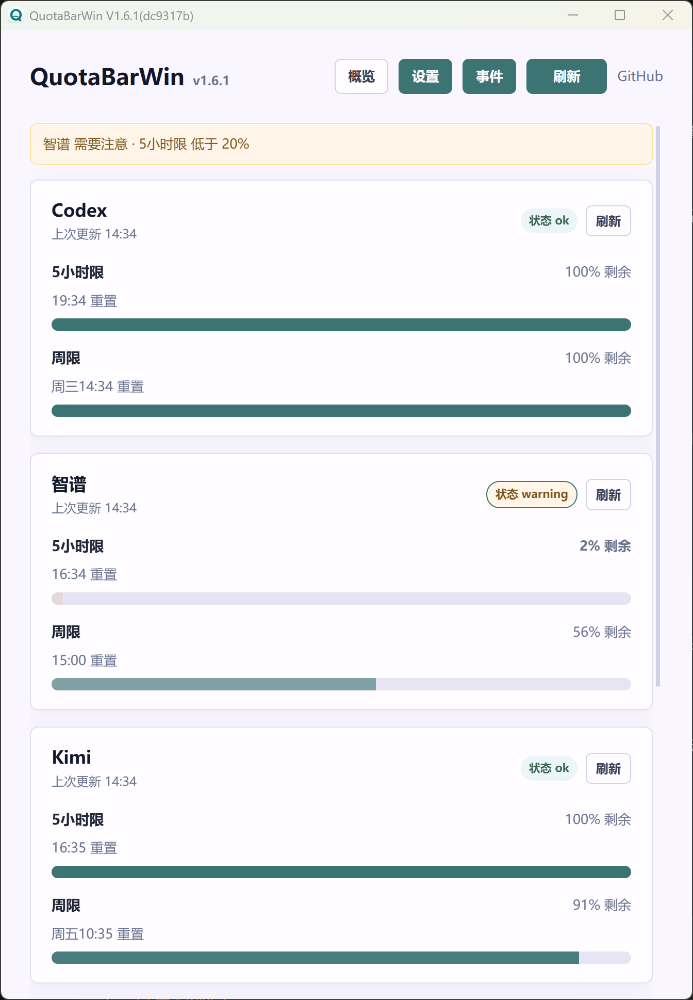
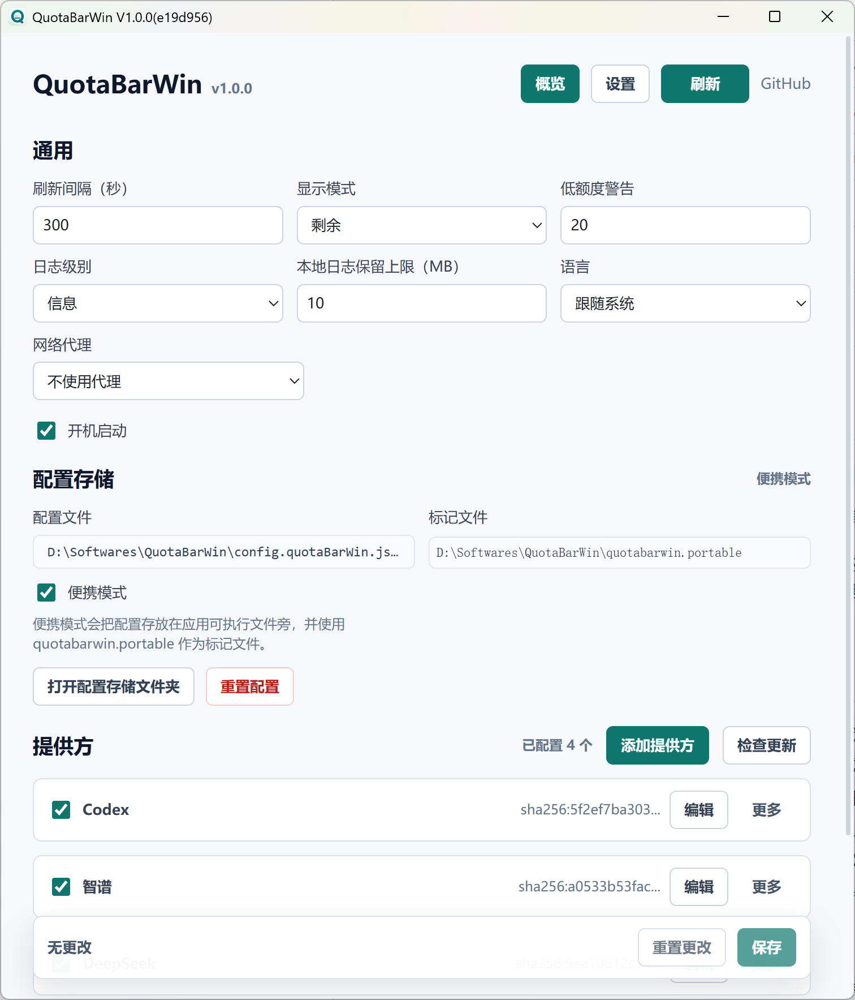
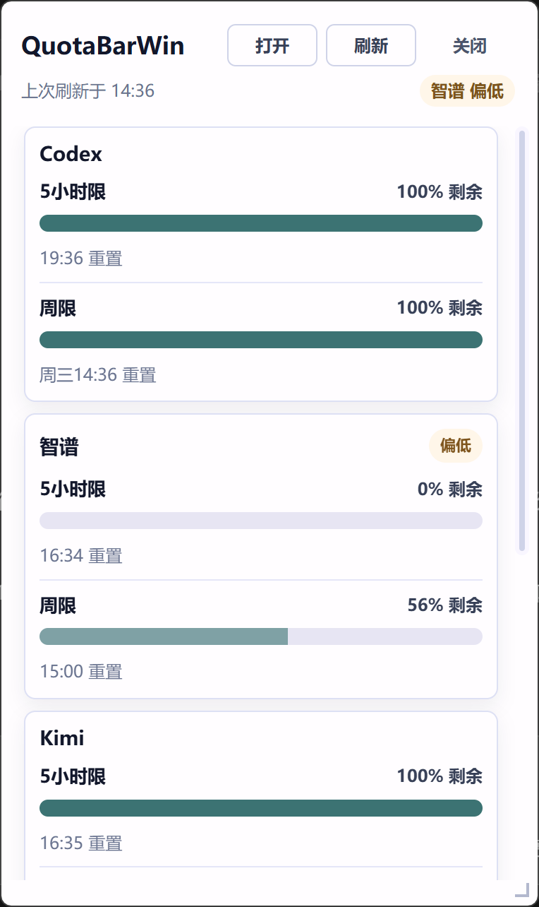

<p align="center">
  
</p>

<h1 align="center">QuotaBarWin</h1>

QuotaBarWin 是一个仅支持 Windows 的 AI 用量 / 额度监控桌面工具，用来把多个 AI 服务的额度窗口统一展示在主窗口和托盘弹窗里。

macOS 用户可以使用或参考 [CodexBar](https://github.com/steipete/CodexBar)，它是一个 macOS 菜单栏 AI 用量监控工具。

默认语言：简体中文。English documentation: [README.en.md](README.en.md).

---

## 文档入口

- [English README](README.en.md)
- [远程提供方作者指南](docs/remote-provider-guide.md)
- [本地集成 API](docs/local-integration-api.md)
- [Agent / CLI 使用指南](docs/cli.md)
- [远程提供方示例](examples/remote-providers/)
- [远程提供方 registry 示例](examples/remote-providers/registry.json)
- [贡献指南](CONTRIBUTING.md)
- [安全政策](SECURITY.md)
- [行为准则](CODE_OF_CONDUCT.md)
- [开源准备审计](docs/open-source-checklist.md)

---

## 当前发布形态

- 平台：**Windows**
- 分发方式：**绿色版 portable zip + 单 exe**
- 当前版本：**v1.6.0**
- 技术栈：Tauri 2、Rust 2021、React 19、TypeScript、Vite
- 当前配置 schema version：**23**

---

## 运行截图

主窗口提供概览页和设置页；托盘弹窗用于快速查看关键额度。

<p align="center">
  
  
</p>

<p align="center">
  
</p>

---

## 快速上手

QuotaBarWin 发布包不会内置你的账号凭据，也不会默认启用某个服务账号。应用默认配置了 QuotaBarWin 项目维护的远程提供方来源，设置页会从这个 registry 展示可安装的提供方：

[QuotaBarWin 项目维护的提供方 registry](https://raw.githubusercontent.com/Shawlaw/QuotaBarWin/main/examples/remote-providers/registry.json)

**安全提示：只安装使用可信任的提供方。`builtin-js` 只能访问 manifest 明确声明的环境变量、文件和网络 origin；外部 runtime 提供方则按其自身 runtime 的权限运行。**

应用内也可以随时打开这份指南：**设置 → 左侧导航底部「使用说明」**，内容会在系统浏览器中打开（同一页面内置中英文切换）。

### 1. 安装并启动

1. 从 GitHub Release 下载 Windows portable zip，解压到任意目录。
2. 运行 `QuotaBarWin.exe`。如果是 portable zip，配置、日志、secrets 和提供方缓存默认都会放在 exe 旁。
3. 项目维护的示例提供方都使用内置 `builtin-js` runtime，安装和刷新不要求 Node.js。第三方提供方若声明 `node`、`python`、`pwsh`、`bash` 或绝对可执行路径，才需要安装其对应 runtime。

### 2. 选择项目维护的提供方

QuotaBarWin 项目维护的 registry 当前包含以下 manifest；实际可安装列表以 registry 为准：

| Manifest ID | 显示名称 | 监控内容 | 常用凭据 / 配置 |
|---|---|---|---|
| `kimi-coding` | Kimi Coding Usage | Kimi coding quota 用量 | `KIMI_API_KEY` |
| `bigmodel-coding-plan` | BigModel Coding Plan | 智谱 / BigModel coding plan 额度 | `BIGMODEL_API_KEY` |
| `codex-usage` | Codex Usage | ChatGPT / Codex 5h 与 weekly 用量 | 默认读取本机 Codex auth，可用 `CODEX_ACCESS_TOKEN` 等覆盖；代理见第 5 节。 |
| `deepseek-balance` | DeepSeek Balance | DeepSeek 按量付费余额 | `DEEPSEEK_API_KEY`，可选参考总额、低余额阈值和币种。 |
| `time-flies` | 光阴似箭 (Time Flies) | 以分钟显示本日、本周、本月和本年余时 | 无；只读取本机时区和当前时间。 |

### 3. 安装提供方

**安装前请再次确认来源可信。提供方脚本会在你的机器上运行，可以读取你配置给它的 token、API key、Cookie、账号 ID 等鉴权信息，并访问网络。**

1. 打开 **设置 → 提供方 → 添加提供方**。
2. 默认会加载 QuotaBarWin 项目维护的提供方来源；如果列表为空，可以在 **管理来源** 中填入上面的 registry URL。
3. 点击需要的提供方的 **安装**。应用会立即打开该账号的配置表单；新实例在验证成功前默认停用，不参与周期刷新。
4. 同一提供方需要多个账号时，再次点击已安装项的 **添加账号**。

### 4. 配置凭据

安装后按表单填写账号名称和必要的 API Key，点击 **保存并测试** 即可。成功后提供方会自动启用，并显示简短的额度预览；失败时会保留已安全保存的配置，显示可重试的原因。

普通流程不需要创建 `secrets` 目录、创建 txt 文件、输入 `${secret:...}` 或编辑原始环境变量。应用把每个账号的密钥自动写到：

```text
<config-dir>\secrets\providers\<provider-instance-id>\<parameter-name>.txt
```

主配置只保存 `${secret:providers/<provider-instance-id>/<parameter-name>}` 引用，已有密钥不会回显到界面。默认使用 Windows 数据保护（DPAPI）加密保存这些文件，密文只能在当前 Windows 账户下解密；因此把配置目录复制到其他电脑或账户后，需要在提供方设置里重新输入密钥（便携模式换机同样适用）。**「设置 → 高级 → 密钥安全」** 可以随时启用或关闭加密并迁移已有文件，迁移范围同时包括手动创建的 `secrets\NAME.txt` 用户密钥文件（见下文 Secret 占位符）：这些文件加密后仍按原来的 `${secret:NAME}` 方式解析，但不能再直接用文本编辑器编辑，需要先在设置页关闭加密恢复明文；若加密已启用但仍检测到明文密钥文件（如旧版本升级遗留），「密钥安全」还会提供「加密剩余明文密钥」一键迁移。从旧版本升级的用户会在首次启动时看到一次性确认提示，自行决定是否把现有明文密钥迁移为加密存储；选择暂不启用则继续明文保存，之后仍可在设置页启用。

**高级兼容模式：** 旧 `${secret:NAME}`、`${env:NAME}`、`${file:C:\path\secret.txt}`、明文值和原始 **环境变量** 编辑器仍然可用，适合已有自动化或第三方提供方；这些不会在升级时被强制迁移。

### 5. 代理

Codex usage 需要代理时，可以在该提供方配置表单的 **高级设置** 中填写运行期代理；已有原始环境变量配置也继续有效，例如：

```text
HTTPS_PROXY=http://127.0.0.1:7890
```

Codex usage 的代理由内置 runtime 宿主处理：提供方环境变量 `QBWIN_PROXY_URL` 优先，项目全局代理为兜底；全局代理选择“系统”时会读取 Windows 进程环境中的 `HTTPS_PROXY` / `HTTP_PROXY`。支持 `socks5:`、`socks5h:`、`http:` 和 `https:`。安装源的代理仅用于下载 registry、manifest 和脚本。更完整的请求、鉴权和代理说明见 [`examples/remote-providers/codex-usage/api.md`](examples/remote-providers/codex-usage/api.md)。

全局代理可在 **设置 → 高级 → 网络代理** 中点击 **检测代理**。检测使用当前尚未保存的代理设置，默认请求 GitHub 首页；企业网络或 GitHub 不可达时，可在高级选项临时填写其他 HTTPS 地址。检测地址不会写入配置，应用不保存响应内容，也不显示原始网络错误。

### 6. 多账号

多账号时，对已安装的提供方点击 **添加账号**。每个新账号都有独立的提供方实例和托管 secret 目录，不会共享或覆盖另一个账号的 API Key。高级用户仍可保留自己的 `${secret:...}` / `${env:...}` / `${file:...}` 映射。

### 7. 保存并查看

在配置表单中点击 **保存并测试**。成功后可点击 **完成** 返回概览；选择稍后配置的提供方会保持“待配置”且不参与后台刷新。常规设置和高级原始配置仍可点击 **保存**（或按 Ctrl+S）。

---

## 本地集成 API

可在 **设置 → 高级 → 本地集成 API** 启用 HTTP API。启用后默认只监听本机回环地址：`http://127.0.0.1:41833`。它适合本机自动化、脚本、浏览器扩展或其他桌面工具直接读取统一后的额度快照，不需要通过应用目录下的文件交换数据。

- `GET /v1/health`：查询服务与快照可用状态。
- `GET /v1/snapshot`：读取最近一次归一化额度快照。
- `POST /v1/refresh`：异步触发一次刷新，随后再读取快照。

默认仅本机可访问且不要求鉴权。可在同一设置页关闭服务、修改端口，或选择一个或多个具有 IPv4/IPv6 地址的活动网卡，也可监听全部活动网卡；网络监听默认也会同时保留无需 Token 的 `127.0.0.1`。勾选本机回环时，即使未选外部网卡也可保存并作为仅本机服务运行。启用外部网卡前，必须先在设置页保存手动填写或随机生成的 Bearer token；未保存令牌时无法保存网络监听设置。已保存令牌会以掩码状态显示，可直接复制、替换或重新生成，且不会写入主配置、日志或 API 响应。该 API 只提供只读快照与刷新入口，不提供对提供方、配置或凭据的修改接口。

完整的请求、响应和安全边界见 [本地集成 API 文档](docs/local-integration-api.md)。

---

## 事件历史与通知

主窗口顶部「事件」页是应用内的事件历史，记录：

- 应用启动、应用升级完成；
- 额度重置、额度异常回升（周期未结束时额度大幅恢复）、额度用尽、额度低于警告阈值；
- 提供方刷新异常与恢复。

事件在每次刷新后基于新旧快照对比判定，瞬时抖动会先经二次确认，因此记录的都是已确认的变化。事件按类别筛选、手动刷新和一键清空，仅保存在本机配置目录（`events.quotaBarWin.json`，最多 200 条），不包含提供方 metadata 或凭据。

在 **设置 → 通知** 中可以开启两类通知通道（默认均关闭）：

- **Windows 系统通知**：以 toast 弹出所选事件；便携版会在当前用户的注册表中登记应用的 AppUserModelID，无需安装器，关闭该通道后会自动清除本机的通知注册信息。
- **Webhook**：将所选事件以 JSON POST 批量发送到指定地址。URL 支持 `${secret:NAME}`、`${env:NAME}`、`${file:...}` 占位符（例如把含 token 的 webhook 地址存进 `secrets` 目录），遵循全局代理设置，可配置超时；发送失败只写脱敏后的本地日志。

通知在变化发生后的**下一次刷新**时送达（默认间隔 300 秒，可在设置中调小）；应用未运行时不会补发。Webhook 会把额度事件数据发送到你指定的外部地址，请注意只填写自己信任的服务。

---

## Agent / CLI

portable 发布包同时包含 `QuotaBarWin.Cli.exe`。它复用已安装提供方、凭据和配置，为 Agent 或脚本提供只输出 JSON 的额度查询与阈值判断；不会打开窗口、托盘或启动另一个桌面应用实例。

例如，让 Agent 在开始高消耗步骤前刷新 Codex 的 5 小时窗口：

```powershell
.\QuotaBarWin.Cli.exe check --provider codex-usage --window 5h --min-remaining-percent 20
```

退出码 `0` 表示可以继续，`10` 表示低于阈值、应延后或切换任务，`11` 表示数据无法安全判断（例如提供方数据已过期），`20` 表示刷新或配置失败。默认会实时刷新；仅想读取最近磁盘快照时，显式传入 `--cached`。

完整的命令、JSON 输出和 Agent 编排示例见 [Agent / CLI 使用指南](docs/cli.md)。`resetAt` 是提供方给出的下一次重置或建议重查时间，不保证届时一定恢复到满额。

CLI 也可在安装前或排障时校验提供方配置、manifest、source checksum 和 runtime：`QuotaBarWin.Cli.exe validate --provider codex-usage`。详见指南中的提供方校验章节。

---

## 核心能力

- 在概览页按提供方展示额度窗口、剩余额度、重置时间、状态和进度条。
- 提供本地 HTTP API，以及面向 Agent 与脚本的 JSON CLI，支持刷新、读取快照和按剩余百分比判断是否应延后任务。
- 支持单个提供方手动刷新，也支持按全局间隔自动刷新。
- 应用内「事件历史」页记录应用启动/升级、额度重置/异常回升/用尽/偏低、提供方异常与恢复等事件，仅存本机、可筛选可清空。
- 支持事件通知：Windows 系统通知（toast）与 Webhook（JSON POST），可按事件类型勾选并支持「发送测试通知」。
- 支持 Windows 托盘、隐藏启动、单实例运行和可调整尺寸的托盘弹窗。
- 设置页按「提供方 / 通用 / 通知 / 应用更新 / 高级」分类组织：通用保留刷新间隔、显示模式、语言、亮/暗主题与开机启动；低额度警告阈值统一在「通知」中编辑，通用页提供摘要与跳转；网络代理、本地集成 API、密钥安全、配置存储与日志归入「高级」。主题默认跟随 Windows 系统，并可固定为浅色或深色。
- 支持 AppData 配置和便携模式；便携模式会把配置、日志、secrets 和远程提供方缓存放在 exe 旁。
- 支持提供方启用状态、排序、自定义窗口显示和窗口名称覆盖。
- 支持从 remote registry / manifest 安装提供方，并进行缓存、SHA-256 校验和更新检查。
- 支持用于远程安装/更新和提供方运行兜底的全局代理，代理类型包含 HTTP 与 SOCKS5，并可在保存前检测代理可用性；提供方可通过环境变量配置自己的运行期代理。
- 支持 secret 占位符，避免在配置和日志中直接保存真实密钥。
- 界面内屏蔽 WebView 默认的网页右键菜单（含「刷新」等易误触条目）；输入框右键保留系统剪切/复制/粘贴，选中文本的 Ctrl+C 等快捷键不受影响。

---

## 提供方模型

QuotaBarWin 的核心架构原则是：**提供方是唯一对外数据抽象**。

用户可见的提供方统一来自 remote registry / manifest。提供方脚本内部可以使用 API 请求、CLI 工具、JSON 解析或文本解析，但前端只消费归一化后的 `AppSnapshot`、`ProviderSnapshot` 和 `QuotaWindow` 数据。

提供方配置类型：

| Kind | 来源 | 说明 |
|---|---|---|
| `remote` | 缓存提供方脚本 | 从 registry / manifest 安装。官方提供方使用内置 `builtin-js`；也兼容 `node`、`python`、`pwsh`、`bash` 或绝对路径。 |

---

## 运行环境和软件依赖

需要区分主程序、远程提供方和开发环境三类依赖：

| 场景 | 需要安装 | 说明 |
|---|---|---|
| 使用发布版 `QuotaBarWin.exe` / `QuotaBarWin.Cli.exe` | Windows；GUI 需要 Microsoft Edge WebView2 Runtime | portable zip 包含桌面程序和 CLI；CLI 不依赖 WebView2。两者都不要求用户安装 Node.js、npm、Rust 或 Tauri CLI。 |
| 安装 / 运行远程提供方 | `builtin-js` 不需要额外软件；其他 runtime 需要对应软件 | `builtin-js` 使用应用内置 QuickJS，当前全部项目维护提供方都使用它。外部 runtime 会从 `PATH` 或绝对路径解析，并在安装 / 更新时校验；例如声明 `"runtime": "node"` 才需要可执行的 `node`。 |
| 开发、测试、构建本仓库 | Node.js 22+、npm、Rust stable / Cargo、Windows MSVC build tools | `package.json` 要求 `node >=22`，Release workflow 也使用 Node 22。`npm run tauri ...` 和 `cargo test ...` 需要 Rust 工具链；完整 E2E 还需要 `tauri-driver`。 |

外部 runtime 提供方还可以自行调用其他 CLI 或读取本地凭据文件；这些不属于 QuotaBarWin 的统一依赖，应由对应提供方文档声明。`builtin-js` 不提供子进程或任意文件访问，详见[远程提供方指南](docs/remote-provider-guide.md#内置-javascript-runtimebuiltin-js)。

---

## 配置和隐私

Windows AppData 配置：

```text
%APPDATA%\QuotaBarWin\config.quotaBarWin.json
```

启用便携模式时，可执行文件旁的配置：

```text
<app-exe-dir>\config.quotaBarWin.json
```

远程提供方脚本缓存目录：

```text
%APPDATA%\QuotaBarWin\providers\remote\<provider-id>\
```

启用便携模式后，远程提供方缓存会改为使用 exe 同目录下的 portable 存储。缓存始终跟随当前生效的配置目录解析：切换存储模式时会迁移已有的提供方缓存（迁移或写入配置失败会回退，避免留下半迁移状态）；日常启动只会把配置里记录的缓存路径校正到当前目录，不会移动文件。缓存目录丢失或损坏时，刷新会自动从配置的清单地址重新下载修复。

Secret 占位符：

- `${secret:NAME}`：读取 `<config-dir>\secrets\NAME.txt`，找不到时回退到环境变量 `NAME`。文件可以是明文，也可以是设置页「密钥安全」迁移出的 DPAPI 加密内容，两种格式解析结果相同。
- `${env:NAME}`：读取环境变量 `NAME`。
- `${file:C:\path\secret.txt}`：读取本地文件并裁剪首尾空白。

同一个提供方配多个账号时，在每个账号实例的“环境变量”里把脚本需要的变量名映射到不同 secret，例如
`KIMI_API_KEY=${secret:KIMI_WORK_API_KEY}` 会读取
`<config-dir>\secrets\KIMI_WORK_API_KEY.txt`。详见
[`docs/remote-provider-guide.md`](docs/remote-provider-guide.md#本地配置与-secret)。

不要把真实 API key、token、cookie、账号 ID 或代理凭据写入代码、文档、fixtures 或测试。

---

## 开发

开始前请先确认已安装上面的开发环境依赖。

安装依赖：

```powershell
npm install
```

启动浏览器预览：

```powershell
npm run dev
```

启动 Tauri 桌面应用：

```powershell
npm run tauri dev
```

预览应用更新提示 UI（不会联网、下载或修改更新缓存）：

```powershell
$env:QBWIN_DEMO_APP_UPDATE="1"
npm run tauri -- build --features update-preview --no-bundle
& .\src-tauri\target\release\quotabarwin.exe
```

启动后打开主窗口或托盘小窗，约 700ms 后会显示一次模拟更新提示，可体验入场动画、“前往更新”和“稍后”。将环境变量改为 `manual` 时，启动后不会显示提示；在“设置 → 应用更新”点击“检查应用更新”才会模拟发现更新，适合验证手动检查后的主窗口与托盘小窗同步提示。普通 Release 构建不包含该预览功能，只有显式使用 `update-preview` 特性构建的内部预览版本会读取该环境变量。

构建前端资源：

```powershell
npm run build
```

运行测试：

```powershell
npm run test -- --run
cargo test --manifest-path src-tauri/Cargo.toml
```

检查图标：

```powershell
npm run icons:check
```

E2E 使用 `tauri-driver` 和 WebDriverIO：

```powershell
npm run e2e
```

如需安装 `tauri-driver`：

```powershell
cargo install tauri-driver --locked
```

注意：E2E 当前是维护者可选检查，不能替代上面的常规构建和单元测试。运行前请先退出所有已运行的 QuotaBarWin 实例；Tauri 单实例机制会把新启动重定向到已有进程。脚本会构建 release app，并写入临时 portable 配置和本地 remote 提供方 cache。排查失败时可设置 `QBWIN_E2E_KEEP_ARTIFACTS=1` 保留这些临时文件。

---

## 构建和发布

本地 release exe 构建：

```powershell
npm run tauri -- build --no-bundle
```

Windows release 由 `.github/workflows/release.yml` 生成。当前发布工作流构建 `QuotaBarWin.exe`、`QuotaBarWin.Cli.exe` 和 `QuotaBarWin.Updater.exe`，并打包为 portable zip，文件名格式为：

```text
QuotaBarWin_<version>_windows_x64_portable_<commit>.zip
```

zip 内包含 `quotabarwin.portable`，解压后默认使用可执行文件旁的 portable 配置。推送 `v*` tag 时，zip 会上传为 GitHub Release asset，并自动将 `CHANGELOG.md` 中对应版本的段落写入 Release 说明；手动触发工作流时会保留为 Actions artifact。

### 应用自动更新发布配置

应用更新由 DeskFoundry 的 `desktop-updater` 提供。客户端从 GitHub Raw 读取已签名的 `updates/stable.json` 和 `.sig`，再从 GitHub Release 下载 ZIP；它只覆盖发布包白名单中的 exe，`quotabarwin.portable`、配置、日志、secrets、提供方缓存和用户文件都会保留。

首次启用前，维护者必须按 [DeskFoundry portable 更新规范](https://github.com/Shawlaw/DeskFoundry/blob/main/docs/portable-update-guide.md) 为 QuotaBarWin 生成独立 Ed25519 密钥：私钥写入仓库 Actions secret `DESKTOP_UPDATE_PRIVATE_KEY`，公钥写入仓库变量 `QUOTABARWIN_UPDATE_PUBLIC_KEY`。Release 工作流会把公钥编译进客户端、打包 `QuotaBarWin.Updater.exe`，然后通过固定版本的 `DeskFoundry@v0.1.4` Action 签名并提交 Raw 更新指针；该 Action 会先验证 secret 私钥与这个公钥确为同一对，`desktop-update.toml` 仅定义 ZIP 覆盖白名单。

---

## 安装和卸载

安装：从 GitHub Release 下载 portable zip，解压到任意目录后直接启动 `QuotaBarWin.exe`。

首次包含更新器的版本仍需手动下载安装。之后可在“设置 → 应用更新”检查新版并选择“下载并重启更新”。

“设置 → 应用更新”默认开启自动检查：每天本地时间 08:00 后，首次打开主窗口或托盘小窗时会在后台检查一次；如果检查暂时失败，应用会在稍后自动重试。发现新版本时，自动或手动检查都会让主窗口和托盘小窗显示升级提示；“稍后”会关闭提示并静默当前版本。点击“前往更新”会打开设置页并定位到“应用更新”区，用户可直接继续“下载并重启更新”。下载始终使用提示所对应、已签名校验的版本，不会在点击下载时改为官网随后发布的较新版本；手动再次检查才会刷新候选版本。自动检查不会自动下载、安装或重启。用户可随时在设置中关闭此功能。

卸载：先从托盘菜单退出 QuotaBarWin，然后删除解压目录。

portable zip 默认把设置、日志、secrets 和远程提供方缓存在解压目录。如果之前使用过 AppData 模式，也可以删除 `%APPDATA%\QuotaBarWin`。

---

## 排障建议

- 如果额度长时间不更新，先在设置页检查提供方是否启用，再执行单提供方刷新或全局刷新。
- 如果远程提供方安装或更新失败，优先检查 registry / manifest 地址、网络代理和 SHA-256 校验值。
- 如果提供方需要密钥，优先使用 secret 占位符，不要把密钥明文写进配置。
- 如果需要反馈问题，请附上应用日志中的相关时间段，并注意手动删除敏感信息。

---

## 开源协作

- 许可证：[MIT](LICENSE)
- 贡献流程：[CONTRIBUTING.md](CONTRIBUTING.md)
- 安全漏洞披露：[SECURITY.md](SECURITY.md)
- 行为准则：[CODE_OF_CONDUCT.md](CODE_OF_CONDUCT.md)

提交 issue 或 PR 前，请先确认没有包含真实 API key、token、cookie、账号 ID、日志原文中的敏感片段或代理凭据。
